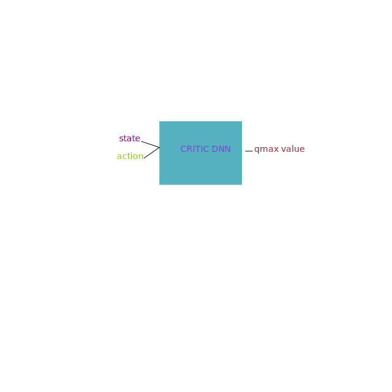

This File explaines the code written to train a T3D network

## Step 1:
If we train the model on sequential data, the may not be able to generalize very good. It may only learn from consecutive steps. So what we use the concept of replaybuffer wher we initially fill the storage of max size with some transitions(s--current state,a--current action,s'--next state,a'--next action).we fill up the memory with these tuple and in train time we randomly sample from these tuples to train our network

The ReplayBuffer class has add method to fill transitions and sample method to sample during train time

## Step 2:
Actor Model takes state and predicts actions
In T3D we use 2 Actors (actor model and actor target)
actor model is trained using backpropagation 
actor target is trained using polyak average
max_action parameter determines the amplitude of the actions to be taken thus restricting the action amplitudes

[Actor]()

## Step 3:
Critic model takes state and action as input and predicts the Max Q value
In T3D we use total 4 Critic (Critic_1 model and Critic_1 target,
Critic_2 model and Critic_2 target)
Critic model is trained using backpropagation 
Critic target is trained using polyak average

[Critic Model]()
## Step 4:
The overall idea of the training is that we let out both critic target model interact with the environment and we take the min q value from them. we pass it to critic model and the critic model inturn updates the actor model. Then we train the target models by polyak avg
This steps starts the training process by fetching train samples from the reply_buffer obj. It then loads the return values on device.
the inputs are replay_buffer obj, num_iterations to run training, batch_size, discount factor(from bellman equation), tau is for polyak averaging, policy noise value to add to actions, max value of the actions, update factor for our actor
## Step 5:
To train out critic we need next_state and next_action, we pass next_ state to actor_target  model to predict the next_action

## Step 6:
We add gaussian noise to our next_action
## Step 7:
Now we have 2 inputs ready for the critic_target model. next_state, next_action. we Pass this values to Critic class which returns 2 target model q value prediction. target_Q1,target_Q2
## Step 8:
We then take a minimum of target_Q1,target_Q2 to be extra sure

## Step 9:
We use the done parameter to indicate if the episode is over and then we calculate final target_Q
## Step 10:
Now calculate current_Q values from the 2 critic model networks
## Step 11:
Using both current_Q and target_Q we will calculate  the loss
## Step 12:
Backpropagate the loss on critic model after clearing grads(pytorch accumulates gradients)

## Step 13:
train the actor after training the critic twice(policy_frequncy)
actor loss is calculated by passing current state to critic and the action predicted by the actor(sort of like adverserial loss) and mean over a batch

## Step 14:
Update Actor target by polyak Average once every two iterations.
## Step 15
Update Critic target by polyak Average once every two iterations

[text]()